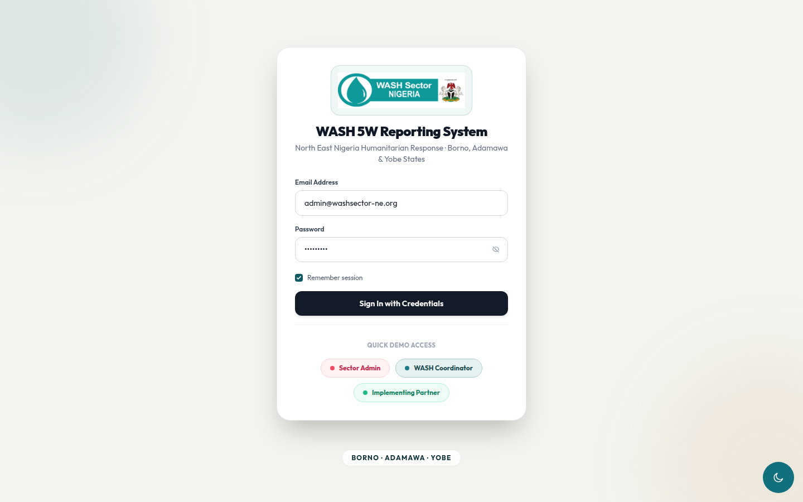
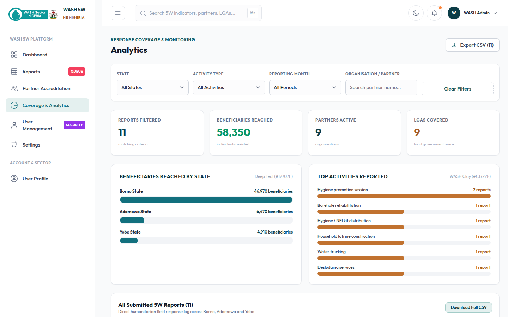
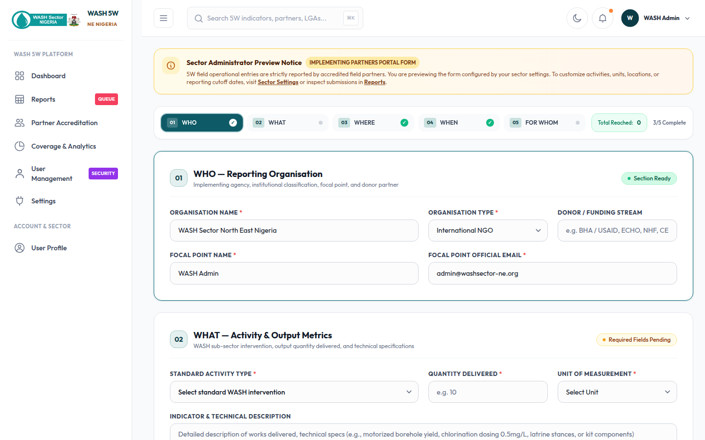
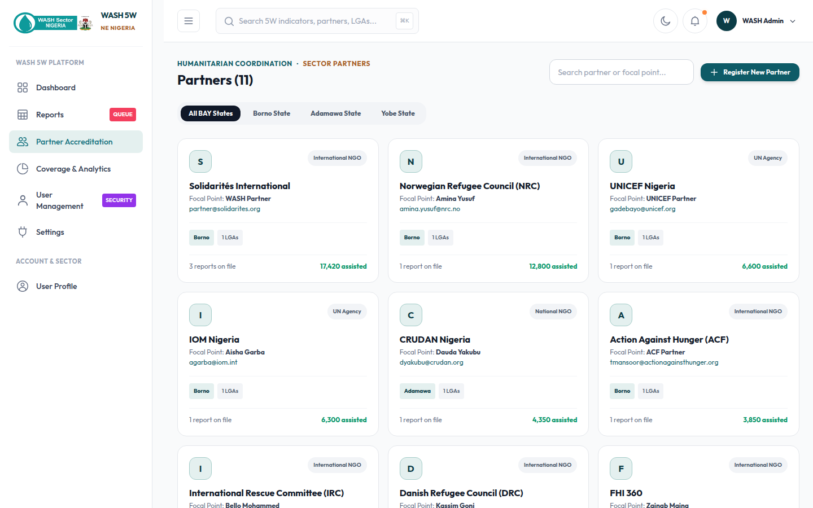
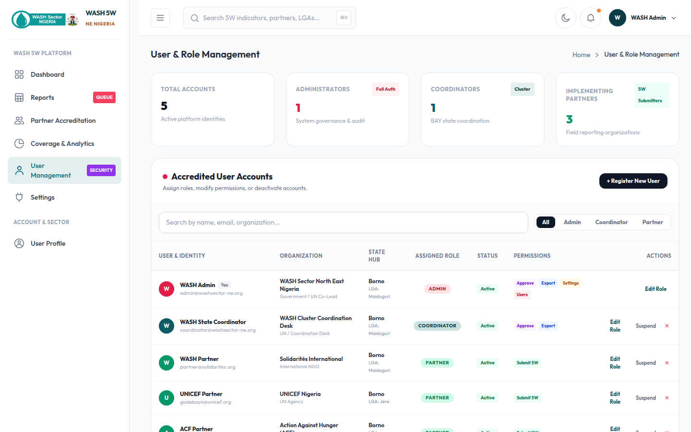

# WASH Reporting System User Guide

Welcome to the **WASH Reporting System**, a comprehensive 5W submissions directory and database for Borno, Adamawa, and Yobe states. This guide walks you through the core features of the platform.

---

## 1. Login Page
The system requires authentication to ensure that data is securely managed by authorized partners and administrators.

- **Email-based Login**: Enter your registered email address to access your specific role dashboard. 
- **Roles**: Access is tailored to three main roles: *Sector Administrator*, *State Coordinator*, and *Implementing Partner*.

---

## 2. Main Dashboard
Upon logging in, you are greeted with the Main Dashboard. This provides a high-level overview of the WASH Sector's key performance indicators.

- **Quick Stats**: View the total beneficiaries reached (disaggregated by men, women, boys, girls, and PWDs), total active projects, and budget utilization.
- **Recent Activity**: A timeline of the latest verified 5W entries and alerts.
- **Charts and Maps**: Visual breakdowns of beneficiaries by location and intervention types (e.g., Borehole rehabilitation, Hygiene kit distribution).

---

## 3. Coverage Dashboard
The Coverage Dashboard is essential for State Coordinators and Administrators to monitor intervention spread across different Local Government Areas (LGAs).

- **Interactive Maps**: Visualize which LGAs have the highest concentration of WASH interventions and which areas are underserved.
- **Funding Overview**: Track funding gaps and budget allocations across different states.

---

## 4. Submitting a 5W Report
Partners can submit their monthly or quarterly 5W (Who, What, Where, When, For Whom) reports directly through the system.

- **Organization Details**: Pre-filled based on your partner profile.
- **Intervention Data**: Specify the activity type (e.g., Household latrine construction), quantity, and indicator description.
- **Location & Timeline**: Select the state, LGA, and settlement. Set the status (Planned, Ongoing, Completed).
- **Beneficiaries**: Provide a disaggregated count of the individuals reached.

---

## 5. Partners Directory
A centralized directory of all active organizations and implementing partners in the region.

- **Contact Information**: Easily find the Focal Point, email, and organization type for networking and coordination.
- **Status Tracking**: See which partners are currently active, suspended, or under review.

---

## 6. User Management (Admin Only)
Sector Administrators have full control over the user base.

- **Manage Access**: Add new users, edit existing permissions, or suspend accounts.
- **Role Assignment**: Assign users as Partners, Coordinators, or Admins with specific access rights.

---

*For further assistance, please contact the WASH Sector Coordination Desk at `admin@washsector-ne.org`.*
